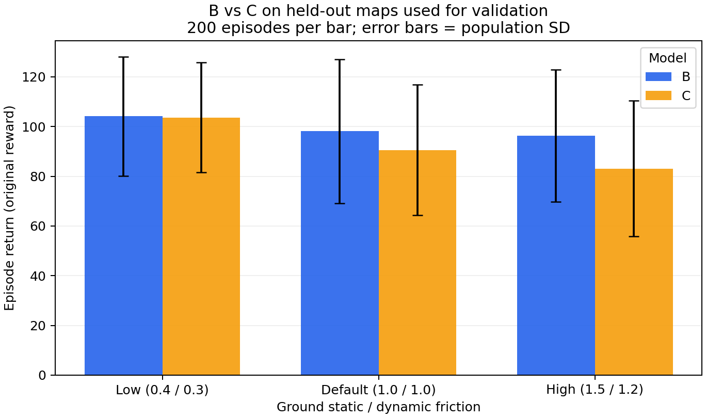

# Robotics Simulation Assignment 1: Ant generalization

Isaac-Ant-v0의 PPO 정책이 새로운 지형·마찰 조건에서 걷도록 하는 실험입니다.
기존 A/B/C 결과와 체크포인트, 보상·관측 개선 실험 코드를 포함합니다.
**현재 실측 추천 후보는 B이며, R/H/HR은 성능 검증 전의 새 실험입니다.**

## 지금 확보한 결과

| 모델 | 학습 조건 | 완료 상태 |
|---|---|---|
| A | 평지, 마찰 1.0, 원본 PPO | 1000 iterations, 최종 모델 포함 |
| B | 험지, 마찰 1.0, 원본 PPO | 1000 iterations, 최종 모델 포함 |
| C | B 지형 + 지면 마찰 무작위화 | 1000 iterations, 최종 모델 포함 |
| R | B + 낙상/낮은 높이/동작 변화 페널티 | 코드 및 기능 검증 대상; 본 학습 필요 |
| H | B + 최근 4개 시점 관측 (60→240차원) | 코드 및 기능 검증 대상; 본 학습 필요 |
| HR | B + 관측 이력 + 보상 변경 | 코드 및 기능 검증 대상; 본 학습 필요 |

완료된 A/B/C 학습은 seed 42, 4096 environments, rollout 32, 1000 iterations이며,
새 실험도 이 학습량을 기준으로 비교합니다.
H/HR은 입력층 크기가 커지며 기존 B/C 체크포인트와 호환되지 않습니다.

B/C를 같은 험지 seed 2001/2002, reset seed 24에서 각각 100개 환경씩 평가했습니다.
아래는 마찰별 200 episode를 합친 **평균 ± 모집단 표준편차**입니다.

| 지면 정적/동적 마찰 | B reward | C reward | B 평균 steps | C 평균 steps |
|---|---:|---:|---:|---:|
| 기본 1.0 / 1.0 | 98.09 ± 28.88 | 90.55 ± 26.24 | 893.56 | 889.48 |
| 낮음 0.4 / 0.3 | 104.13 ± 23.93 | 103.62 ± 22.12 | 920.71 | 921.24 |
| 높음 1.5 / 1.2 | 96.33 ± 26.53 | 83.08 ± 27.28 | 904.47 | 865.30 |

B가 기본/고마찰에서 우세하고 저마찰에서는 차이가 작습니다. 학습 seed가 하나이고
지도도 두 개이므로 통계적 우위나 일반화 전반을 단정하지 않습니다. 이 지도들은
방법 선택에 사용했으므로 이후에는 validation으로 취급합니다.

A의 **평지** reward는 기본 144.57 ± 25.75, 저마찰 123.01 ± 26.16,
고마찰 130.27 ± 27.26입니다. B/C의 험지 결과와 환경이 달라 직접 순위를 매기지
않습니다. 같은 험지에서 A도 평가해야 합니다. 기존 로그만으로 생존율은 복원할
수 없으며 평균 episode steps를 생존율로 바꾸지 않습니다.



새 평가기로 B/default/terrain2001을 재실행했을 때 기존 reward·steps가 소수점
6자리까지 일치했습니다. 이 실행의 생존율은 92/100, 지도 ray 누락은 0입니다.
이는 해당 한 조건의 결과이며 다른 조건으로 확대 해석하지 않습니다.

원자료: [runs.csv](results/runs.csv), [pooled.csv](results/pooled.csv),
[평가 로그](artifacts/evaluation_logs). `python3 summarize_results.py`로 재생성합니다.

## 저장소 구성

- `overlay/`: 원본 checkout에 설치할 Ant 설정, 새 task, 학습·평가 스크립트
- `artifacts/checkpoints/{A,B,C}/model_999.pt`: 최종 모델 및 `params/*.yaml`
- `artifacts/tensorboard/{A,B,C}/`: 학습 곡선
- `artifacts/evaluation_logs/`: 기존 15개 평가 로그
- `artifacts/videos/`: 기존 play 녹화. 별도 메타데이터가 없어 특정 마찰/seed의
  정량 증거로 사용하지 않는 시각적 참고 영상
- `results/`: 재현 가능한 집계표 및 검증 기록
- `apply_overlay.py`, `overlay_manifest.json`: 기반 commit/파일 해시 확인 후 설치
- `evaluate_matrix.sh`: 동일 지도·마찰 조건의 공통 보상 평가

중간 checkpoint 전체, 캐시, Isaac Sim 자산은 포함하지 않습니다. 기존 학습 결과는
최종 checkpoint, 실제 실행 설정, TensorBoard와 평가 로그로 보존합니다.

## 설치

이 저장소는 전체 IsaacLab 복사본이 아닌 **원본 commit에 적용하는 실험 파일 묶음**입니다.
Isaac Sim 5.1 / IsaacLab 2.3 계열의 수업 환경을 먼저 설치합니다.

```bash
git clone https://github.com/cailab-hy/IsaacLab_RS.git IsaacLab_RS
cd IsaacLab_RS
git checkout e83a5d2f11ca1b5f03b690e1978479e620c500e2
cd ..
git clone https://github.com/Kim-KiSuk/Robotics-Simulation-Assignment-1.git
python3 Robotics-Simulation-Assignment-1/apply_overlay.py --target IsaacLab_RS --check
python3 Robotics-Simulation-Assignment-1/apply_overlay.py --target IsaacLab_RS
```

설치기는 알려진 원본 또는 동일 파일만 허용하며 로컬 변경이 있으면 쓰기 전에
중단합니다. 원본 `ant_env_cfg.py`, 공용 `terrains/config/rough.py`, 기존 PPO
설정은 변경하지 않습니다. Ant의 `__init__.py`에는 새 Task 등록만 추가합니다.
현재 작업 중인 `~/IsaacLab_RS`에는 이미 새 코드가 들어 있어 재설치할 필요 없습니다.
여러 checkout이 있다면 활성 환경의 editable package가 적용한 checkout을 가리키게 합니다.

## 바로 다음에 할 작업

먼저 R(보상만 변경)을 학습하고 B와 비교하는 것을 권장합니다.

```bash
conda activate lerobot-arena
cd ~/IsaacLab_RS
./isaaclab.sh -p scripts/reinforcement_learning/rsl_rl/train.py \
  --task Isaac-Ant-Rough-Reward-v0 --headless \
  --num_envs 4096 --max_iterations 1000 --seed 42 --run_name reward_seed42 \
  env.scene.terrain.terrain_generator.seed=42
```

모델은 `logs/rsl_rl/ant_rough_reward/<실제 학습 폴더>/model_999.pt`에 저장됩니다.
원래 B/C 모델은 그대로 남습니다. 학습 보상이 바뀌었으므로 TensorBoard의 R reward를
B/C reward와 직접 비교하지 않습니다.

예를 들어 제출 폴더가 현재 작업 환경의 `ant_submission`에 있을 때:

```bash
# 기존 B를 새 평가기로 평가. 평가 출력 폴더는 새로운 경로를 사용합니다.
bash ant_submission/evaluate_matrix.sh B Isaac-Ant-Rough-v0 \
  ant_submission/artifacts/checkpoints/B/model_999.pt logs/ant_common_eval 2001 2002

# R 학습 완료 후 CKPT를 실제 경로로 바꿉니다.
CKPT='logs/rsl_rl/ant_rough_reward/실제_학습폴더/model_999.pt'
bash ant_submission/evaluate_matrix.sh R Isaac-Ant-Rough-v0 \
  "$CKPT" logs/ant_reward_eval 2001 2002
```

B/C/R의 평가 Task는 `Isaac-Ant-Rough-v0`, H/HR은
`Isaac-Ant-Rough-History-v0`를 사용합니다. 새 평가기는 원본 7개 보상으로
통일하고 reward·steps·생존율·목표 방향 이동/속도·지도 이탈 여부를 환경별 JSON에
기록합니다. 모델 해시와 실행 설정도 함께 저장합니다. 자동 reset 전의 위치를
사용하며, 완료되지 않은 평가의 평균값은 결과로 저장하지 않습니다.

H와 HR 학습 명령, 가중치 의미, held-out 평가 설계, 제출 인터페이스 주의점은
[보상·관측 실험 안내](overlay/source/isaaclab_tasks/isaaclab_tasks/manager_based/classic/ant/ROBUST_EXPERIMENTS.md)를 참고하세요.
지형 seed만 바꾼 평가는 같은 생성 분포의 새 지도 평가입니다. 진짜 분포 변화는
새 지형 형상/강도 조건을 별도로 정의해야 합니다. 성능 개선 여부는 본 학습과
여러 학습 seed/held-out 평가 후 판단합니다.

## 확인 명령

```bash
./isaaclab.sh -p scripts/environments/check_ant_robust.py --headless
./isaaclab.sh -p scripts/environments/test_ant_friction.py
# 제출 폴더 위치에 맞게 경로를 조정합니다.
tensorboard --logdir ant_submission/artifacts/tensorboard
```

검증 내역은 [VALIDATION.md](results/VALIDATION.md)에 기록합니다.
라이선스와 설계 참고는 [THIRD_PARTY_NOTICES.md](THIRD_PARTY_NOTICES.md)를 참고하세요.
