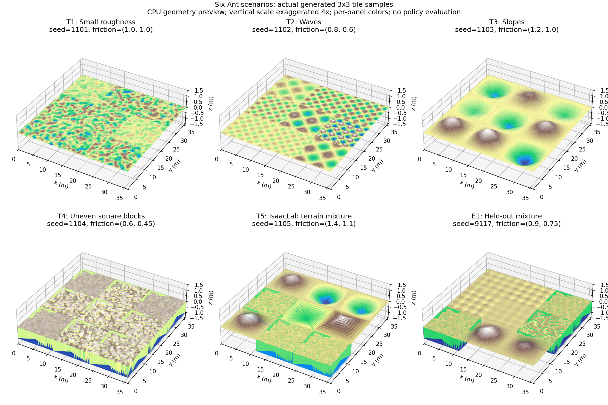
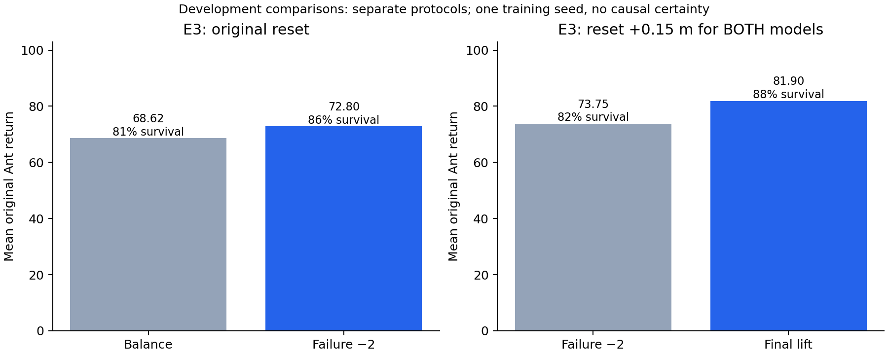
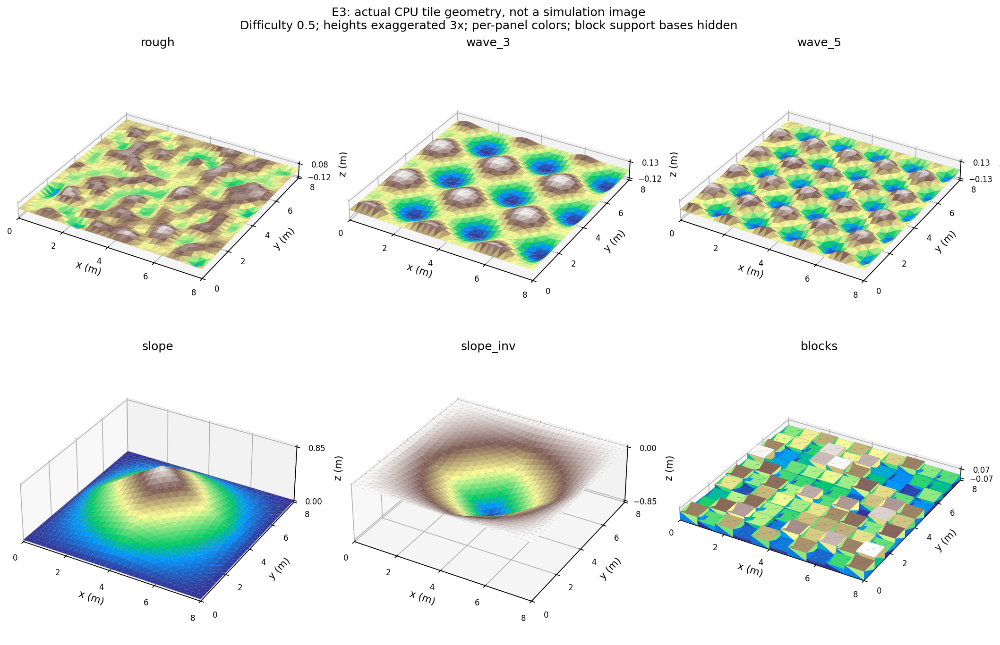
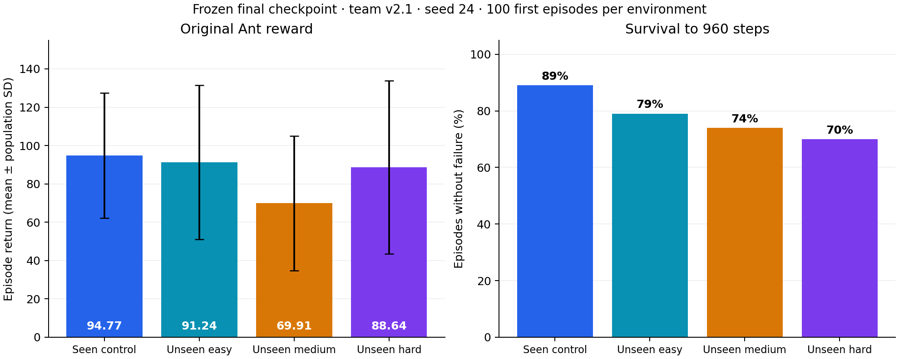

# unseen 지형 보행 학습

**처음 보는 지형에서도 넘어지지 않고 16초 동안 멀리 전진하는 Ant**를 목표로 한다. 학습용 지형 5개와 자체 평가 환경을 만든 뒤, 주변 높이 관측·마찰 다양화·안정성 보상·초기 소환 높이를 검토했다. 최종 모델은 별도의 팀 공통 **v2.1** 환경 네 개에서 평가했다.

최종 결과는 **Seen 94.77점 / Easy 91.24점 / Medium 69.91점 / Hard 88.64점**이다. 처음 보는 세 환경의 960-step 생존율은 **79% / 74% / 70%**였다. 평균 점수가 높아도 모든 개체가 안정적으로 완주한 것은 아니다.

[문제·가설](docs/METHOD.md) · [실험 결과](docs/RESULTS.md) · [구현](docs/IMPLEMENTATION.md) · [재현 명령](docs/REPRODUCE.md) · [영상](docs/MEDIA.md)

## 최종 모델: 네 지형에서의 보행

이미지는 **실제 평가 영상 앞 6초를 원래 속도로** 반복한다. 클릭하면 16초 전체 MP4로 이동한다. 카메라에 보이는 일부 로봇과 **100개 환경 전체의 통계**를 구분한다. 영상은 최종 모델을 고정한 채 녹화용으로 재실행한 기록이다.

| Seen Control · 익숙한 지형 계열 | Unseen Easy · 낮은 rails |
| --- | --- |
| [](artifacts/media/team_v21/SeenControl.mp4) | [](artifacts/media/team_v21/UnseenEasy.mp4) |
| **94.77 ± 32.68점 · 생존 89%** | **91.24 ± 40.22점 · 생존 79%** |

| Unseen Medium · 좁은 틈새 | Unseen Hard · 반복 원기둥 |
| --- | --- |
| [](artifacts/media/team_v21/UnseenMedium.mp4) | [](artifacts/media/team_v21/UnseenHard.mp4) |
| **69.91 ± 35.04점 · 생존 74%** | **88.64 ± 45.20점 · 생존 70%** |

## 1. 무엇을 해결하려 했는가?

평지에서는 반복되는 접촉만으로 전진할 수 있지만, 블록·요철·경사는 발 디딤과 몸체 높이를 바꾼다. 마찰이 달라지면 같은 관절 토크도 다른 움직임을 만든다. 우리는 **경험의 다양성, 지형 정보, 넘어짐에 대한 학습 신호**가 새로운 환경의 전진 성능에 어떻게 연결되는지 조사했다.

| 가설 | 적용한 방법 | 확인할 근거 |
| --- | --- | --- |
| 다양한 접촉 조건을 경험하면 특정 바닥에 대한 의존이 줄어든다 | T1~T5 혼합, 파도 수·블록/계단 폭 확대, 로봇 마찰 randomization | 공통 지형에서 평가; 개별 요소의 기여는 완전히 분리하지 못함 |
| 앞의 지형 정보를 주면 발 디딤에 활용할 수 있다 | 기존 상태 60개 + 주변 지면 높이 63개 | 123D 모델을 처음부터 학습; 센서 단독 효과와 최종 개선 효과는 구분 |
| 흔들림·실패에 작은 비용을 주면 전진을 더 오래 유지한다 | 액션 변화 −0.002, roll/pitch 각속도 −0.01, 실패 사건 −2 | 같은 E3에서 Balance과 Failure2 비교 |
| 시작 시 지형과의 겹침은 정책 외적인 조기 실패를 만든다 | 영 행동 진단 후 학습 reset Z +0.15m | 양쪽 모델을 동일한 SpawnLift E3에서 비교 |

이는 단일 학습 seed 중심의 단계별 실험이다. 모든 조합을 독립적으로 비교한 완전한 ablation은 아니며, 참고 저장소의 Curriculum·4-frame History·3-seed 실험을 수행했다고 주장하지 않는다. [가설별 검증 범위](docs/METHOD.md)

## 2. 다섯 학습 환경에서 하나의 정책으로

| 구성 | 지형과 의도 | 초기 개별 지형 seed |
| --- | --- | ---: |
| T1 | 작은 요철에서 자세·전진 유지 | 1101 |
| T2 | 파도의 반복 높낮이에 대응 | 1102 |
| T3 | 경사·역경사에서 균형 유지 | 1103 |
| T4 | 높이가 다른 사각 블록에서 발 디딤 연습 | 1104 |
| T5 | 계단 상하·random grid·경사 상하 혼합 | 1105 |



그림은 **초기 Six 구성**의 CPU 메시 시각화이며 세로를 4배 확대했다. 실제 학습은 다섯 Task를 따로 합치는 방식이 아니라, 각 구성을 20% 확률로 선택한 하나의 혼합 지도에서 한 정책을 학습한다. 평지 전용 학습 타일은 없지만 블록 윗면과 중앙 플랫폼은 평탄하다.

초기 Mix seed는 1100, E1은 9117이었다. **최종 학습 지형 seed는 1201**, 로봇 마찰 seed는 **42017**이며, 파도 수 2/4/6/8과 여러 블록·계단 폭을 사용한다. 한 실행 안에서 지형 메시와 시작 시 뽑은 마찰은 고정된다. [수치·마찰·파일 경로](docs/IMPLEMENTATION.md)

## 3. 어떻게 보완했는가?

| 단계 | 핵심 변경 | 학습 방식 |
| --- | --- | --- |
| SixMix | 지형·마찰 조건을 혼합 | 60D, 새 정책 학습 |
| HeightScan | 앞쪽을 포함한 9×7 높이 스캔 추가 | 123D, 새 정책 학습 |
| Balance | 다양한 지형·마찰 + 작은 액션 변화·각속도 비용 | 처음부터 학습 |
| Failure2 | 넘어지는 사건에 −2 추가 | 처음부터 학습 |
| **최종 Failure2Lift** | Failure2의 학습 초기 높이를 +0.15m 조정 | **처음부터 학습**, 추가 학습 아님 |

로봇 링크·관절·USD·8개 effort 행동은 유지했다. 강한 자세 감점이나 수직 움직임 억제는 기대한 개선을 보이지 않아 최종 모델에서 제외했다.




원래 E3에서 Balance → Failure2는 보상 **68.62 → 72.80**, 생존율 **81% → 86%**였다. SpawnLift E3에서 기존 Failure2 → 최종 모델은 보상 **73.75 → 81.90**, 생존율 **82% → 88%**였다. 두 표의 reset 조건이 다르므로 하나의 연속 개선 수치로 합치지 않는다. [실패한 실험을 포함한 결과](docs/RESULTS.md)

## 4. 우리가 만든 자체 평가맵

학습용 T1~T5와 별도로 **E1 → E2 → E3**를 만들었다. 새 배치·마찰 확인에서 시작해 연속 지형을 늘리고, 최종적으로 높이가 다른 사각 블록을 다시 포함했다.

| 맵 | 구성과 선정 이유 | terrain seed |
| --- | --- | ---: |
| E1 | T1~T5의 새 배치와 미사용 마찰 조합 | 9117 |
| E2 | 요철 40%·파도 30%·경사 상하 30%; 연속 높낮이 대응 | 9217 |
| E3 | **블록 35%·요철 25%·파도 20%·경사 상하 20%**; 발 디딤과 균형을 함께 시험 | 9317 |
| E3-SpawnLift | E3 메시·마찰 유지, 시작 겹침 진단에 따라 reset Z +0.15m | 9317 |



E3는 **320×320m**, 8m 타일, 지면 마찰 **0.9/0.75**다. 블록 높이 변동 3~12cm, 파도 amplitude 설정 8~18cm, 경사 8~16°로 구성했다. 평지 전용 타일은 없지만 블록 윗면 같은 국소 수평면은 있다. 그림은 실제 생성 메시를 세로 3배 확대한 CPU 시각화다.

[](artifacts/media/self_eval/E3_SpawnLift.mp4)

**자체 최종 평가:** 보상 **81.90 ± 17.05**, episode steps **934.19 ± 95.38**, 생존율 **88%**, 평균 +x 거리 **82.79m**. seed 24, 100개 첫 episode, 원본 7항 보상으로 측정했다. 이 맵은 결과를 보며 모델을 개선한 **개발 검증 환경**이다. 완전히 손대지 않은 최종 시험으로 주장하지 않는다.

[선정 이유·세부 수치·학습과의 차이](docs/SELF_EVALUATION.md) · [원자료](results/development/final_lift/results.json)

## 5. 팀 공통 자체 평가: v2.1



| 환경 | 보상 mean ± std | Episode steps mean ± std | 960-step 생존율 | +x 전진 거리 mean ± std |
| --- | ---: | ---: | ---: | ---: |
| Seen Control | **94.77 ± 32.68** | 916.61 ± 146.35 | **89%** | 96.75 ± 33.45m |
| Unseen Easy | **91.24 ± 40.22** | 811.33 ± 315.09 | **79%** | 93.18 ± 41.00m |
| Unseen Medium | **69.91 ± 35.04** | 784.42 ± 330.97 | **74%** | 72.41 ± 36.04m |
| Unseen Hard | **88.64 ± 45.20** | 774.51 ± 333.17 | **70%** | 90.84 ± 46.14m |

동일한 최종 checkpoint, CLI seed **24**, 환경 **100개**, 첫 episode만 집계했다. std는 에피소드 간 **모집단 표준편차(ddof=0)**이며, 학습 seed 간 표준편차가 아니다. 네 환경 모두 **100/100 완료**했고 **원본 7개 보상·원본 종료 조건·원본 reset**을 사용했다. 학습의 +0.15m reset은 팀 평가에 적용하지 않았다.

**결과 해석:** 새 지형에서도 전진을 유지했지만 생존율 90%는 달성하지 못했다. Medium에서 보상이 가장 낮고 Hard에서 생존율이 가장 낮아, 보상만으로 안정성을 평가할 수 없다. Medium의 실제 빈 틈 때문에 지면 ray 미검출이 발생할 수 있으며, 관측 누락과 실패의 인과관계는 별도로 검증하지 않았다. [상세 분석](docs/RESULTS.md)

[제출 CSV](results/team_v21/final/result_template.csv) · [원본 400 episode·로그·설정](results/team_v21/final) · [영상 재실행 결과](results/team_v21/video_repeat) · [모델·SHA-256](manifest.json)

## 6. 제출용 평가 명령어

[프로젝트 압축본](artifacts/project/IsaacLab_RS_final.tar.gz)을 홈 디렉터리에 풀고 의존성을 설치한 환경에서 아래 명령 하나로 **자체 평가맵 E3-SpawnLift**를 평가한다. 최종 모델·원본 보상·seed 24·100개 환경을 사용하며 영상도 저장한다.

```bash
conda activate lerobot-arena
cd ~/IsaacLab_RS_final

./isaaclab.sh -p scripts/reinforcement_learning/rsl_rl/play_one_episode.py \
  --task Isaac-Ant-Six-Eval-Blocks-HeightScan-SpawnLift-v0 \
  --seed 24 --num_envs 100 \
  --checkpoint artifacts/checkpoints/final_lift/model_5999.pt \
  --headless --diagnostics --video --video_length 960 \
  --video_folder logs/final_self_eval/video
```

[제출할 명령어 TXT](submission/evaluation_command.txt) · [5분 발표 PPT](submission/Ant_Unseen_Terrain_5min.pptx) · [발표 PDF](submission/Ant_Unseen_Terrain_5min.pdf) · [과제 조건 대조표](docs/ASSIGNMENT_CHECK.md) · [설치 안내](docs/REPRODUCE.md)

**제출 마감: 2026년 10월 6일 23:59 / 발표: 10월 8일, 5분.** GitHub 링크·평가 명령어·PPT를 LMS에 조별로 제출한다. 아래의 팀 자체 평가 수치는 조교가 추후 공개할 공식 unseen 평가 결과가 아니다.

| 자료 | 내용 |
| --- | --- |
| [자체 평가맵](docs/SELF_EVALUATION.md) | E1~E3 구성·seed·선정 이유·실제 보행 |
| [Method](docs/METHOD.md) | 연구 문제, 가설, 통제 조건, 검증 한계 |
| [Implementation](docs/IMPLEMENTATION.md) | 환경·관측·보상·마찰·초기화와 원본 대비 변경 |
| [Results](docs/RESULTS.md) | 개발 비교, 실패 사례, 최종 평가 해석 |
| [Reproduce](docs/REPRODUCE.md) | 설치, 제출용 평가, 실행 설정 기록 |
| [변경 코드](overlay) / [원본 설정](reference/original) | 기존 코드에 적용할 파일과 비교 기준 |
| [최종 모델](artifacts/checkpoints/final_lift/model_5999.pt) / [학습 설정](configs/final) | 제출 정책과 저장된 실제 설정 |
| [TensorBoard](artifacts/tensorboard/final_lift) / [그래프 코드](scripts/build_figures.py) | 학습 기록과 그림 재생성 |
| [공개 파일 검증](docs/PUBLICATION.md) | 재현 범위, 영상과 원자료의 관계 |

<details>
<summary>초기 SixMix·HeightScan·Stability 기록</summary>

[이전 README](docs/archive/SIX_STAGE_README.md), [초기 환경 구성](docs/ENVIRONMENTS.md), [초기 결과](results/SIX_RESULTS.md), [당시 학습 명령](docs/REPRODUCE_SIX_STAGE.md)을 보존했다. 최종 v2.1 수치와 별개의 개발 기록이다.

</details>

## 참고
[IsaacLab_RS 고정 원본](https://github.com/cailab-hy/IsaacLab_RS/tree/e83a5d2f11ca1b5f03b690e1978479e620c500e2)과 [Isaac Lab](https://github.com/isaac-sim/IsaacLab)을 기반으로 한다. [출처·라이선스](THIRD_PARTY_NOTICES.md)
