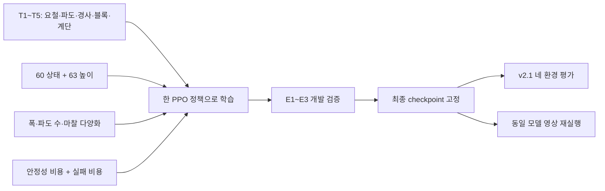

# 연구 문제와 실험 설계

## 연구 문제

목표는 시뮬레이션 내에서 **학습에 없던 지형에서도 제한시간 16초 동안 전진하는 정책**을 만드는 것이다. 평지 학습 reward가 높다는 사실만으로는 블록·경사·새 접촉 조건에서의 성능을 설명할 수 없다. 평가 보상은 원본 Ant 7개 항으로 고정하고, 전진 거리와 생존율을 함께 본다. 실제 로봇 전이는 측정하지 않았다.

## 가설과 실제 적용

| 가설 | 방법 | 현재 근거와 한계 |
| --- | --- | --- |
| 지형·마찰 다양화가 한 바닥에 대한 과적응을 줄인다 | 다섯 구성 혼합 → 파도 개수·폭 변형 → 로봇 마찰 DR | 최종 모델의 새로운 geometry 평가가 있지만, 모든 단계의 동일 평가가 없어 개별 기여는 분리하지 못했다 |
| 주변 높이 관측이 지형에 대한 반응을 돕는다 | 60D 상태에 63개 높이 추가 | 이상적인 메시 센서다. 센서만의 일반화 개선량은 확정할 수 없다 |
| 균형 유지와 실패를 학습 보상에 넣으면 누적 전진이 늘어난다 | 액션 변화·roll/pitch 각속도 비용 + 실패 사건 −2 | E3에서 동일 학습 설정의 Balance와 FailurePenalty를 비교했다. 단일 seed 결과다 |
| 시작 시 접촉 겹침을 줄이면 조기 실패를 줄일 수 있다 | zero-action 진단, reset Z +0.15m | 동일 +0.15m 평가에서 FailurePenalty와 새로 학습한 최종 모델 비교. 모든 collision shape의 겹침 방지를 보장하지는 않는다 |

## 비교를 나누는 기준

E1은 처음에는 별도 seed의 자체 unseen 환경으로 만들었으나, 결과를 보고 모델을 바꾼 이후 **개발 검증용**으로 해석한다. E2/E3도 개발에 사용했다. 최종 v2.1에서는 checkpoint를 고정하고 학습·fine-tuning 없이 평가했다. 영상 재실행은 독립 표본으로 합산하지 않았다.

## 최종 학습 설정

| 항목 | 설정 |
| --- | --- |
| Task | `Isaac-Ant-WaveRange-Diverse-Balance-v0` + 명시적 CLI overrides |
| 알고리즘 | PPO, actor/critic 각각 400–200–100, ELU |
| 입력 / 출력 | 123D / 8개 관절 effort, scale 7.5 |
| 초기 가중치 | 무작위 초기화, resume=false, warm_start 없음 |
| 학습 / 지형 / 재질 seed | 42 / 1201 / 42017 |
| LR / γ / λ | 5e-4 adaptive / 0.995 / 0.95 |
| epoch / minibatch / clip / entropy | 5 / 4 / 0.2 / 0.001 |
| 물리 / 정책 주기 | 120Hz / 60Hz |
| obs normalization / history | 없음 / 없음 |

[env.yaml](../configs/final/env.yaml), [agent.yaml](../configs/final/agent.yaml)이 실행 당시 설정의 근거다. 최종 실험은 terrain seed 1201 하나이며 코드에 남아 있는 1201/1301/1401 반복 스케줄을 사용한 모델이 아니다.

## 해석의 범위

- 한 학습 seed와 한 공식 evaluation seed의 결과다. 100 episode는 학습 seed 100개가 아니다.
- 서로 다른 학습 분포·보상의 TensorBoard reward를 일반화 순위로 비교하지 않는다.
- 실패 감소는 누적 전진에 도움이 될 수 있지만 안정성과 속도의 최적 균형을 찾았다고 단정하지 않는다.
- 강한 자세·수직 움직임 억제가 악화된 기록도 남겼다. 비용을 크게 하면 반드시 좋아지는 것은 아니다.
- Seen Control은 배포본 명칭이다. 익숙한 계열을 포함하지만 실제 학습 분포와 동일하지 않으며 평지도 포함한다.
- 최종 정책에는 성과 기반 curriculum이나 관측 이력을 사용하지 않았다.

[결과 분석](RESULTS.md) · [재현](REPRODUCE.md)
