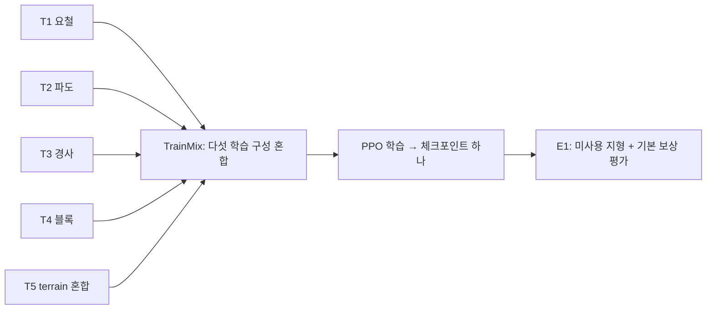
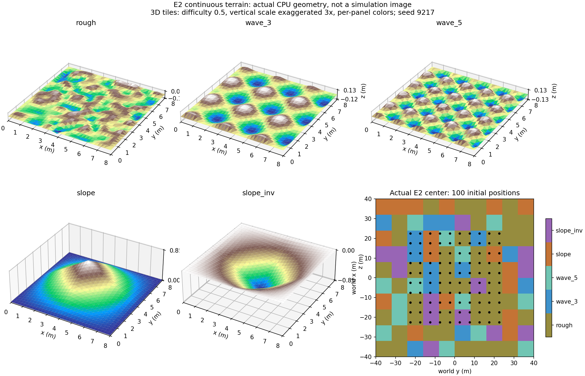

# Ant 환경 제작 기록: 학습용 5개 + 평가용 E1/E2/E3 + 높이 관측

> 이 문서는 HeightScan까지의 상세 제작 당시 기록입니다. 최신 Stability까지의 설명은 [환경 구성](../ENVIRONMENTS.md), [실행 명령](../REPRODUCE.md), [평가 결과](../../results/SIX_RESULTS.md)를 참고하세요.
## 이 결과물의 목적

기본 `Isaac-Ant-v0`에서 출발해, 지형과 마찰이 달라져도 제한 시간 내 전진할 수 있는
정책을 학습하기 위한 환경 세트를 만들었다. 최초 구성은 학습용 T1~T5와 평가용 E1이며,
이후 **연속형 험지 평가용 E2**, **블록 포함 E3**, **123차원 높이 관측 정책**으로 확장했다.
TrainMix의 1024개 × 4000회 학습 로그와 `model_3999.pt`가 확인되었다.
사용자가 실행한 E1 평가 결과는 보상 **72.007249 ± 24.702503**, 길이 **854.810000 ± 254.199083 step**,
seed 24, 환경 100개, 첫 에피소드 100/100 완료다. 이는 E2의 결과가 아니다.
사용자가 실행한 동일 E2 비교에서는 기존 TrainMix가 **54.428906 ± 29.085658**,
평지 Baseline이 **14.283684 ± 12.772225**의 보상을 얻었다.
에피소드 길이는 각각 **733.490000 ± 328.546846**, **409.940000 ± 339.345423 step**이다.
두 평가 모두 seed 24, 환경 100개이며 보상 비율을 이동 거리 비율로 해석하지 않는다.
블록을 함께 평가하려는 추가 요청에 따라 **E3**와 **높이 관측 재학습 설정**을 아래에 추가했다.
E2 점수와 E3 점수는 서로 다른 맵의 결과이므로 직접 모델 우열로 비교하지 않는다.

기존 A/B/C/R/H/HR, Varied 환경, 체크포인트와 로그는 그대로 둔다.
새 Task는 모두 `Isaac-Ant-Six-`로 시작한다. 이 문서의 T1~T5/E1/E2/E3는 환경의 이름이며
학습된 모델의 이름이 아니다.

## 블록 포함 E3와 높이 관측 재학습: 지금 사용할 설정

### 무엇을 왜 바꾸었는가

E2는 연속 지형 구성에 맞추며 블록을 제외했던 평가맵이다. 사용자는 블록도 함께 평가하기를
원하므로 **블록·요철·파도·경사가 함께 있는 E3**를 추가했다. E1/E2와 기존 점수는 보존한다.
E3는 평가용이며 학습에 사용하지 않는다. 새 정책도 기존 TrainMix의 T1~T5에서 학습한다.
T4/T5에 블록이 이미 포함되어 있으므로 블록 경험을 위해 E3를 학습에 섞을 필요는 없다.

| 항목 | 기존 TrainMix | 이번 높이 관측 모델 | 이유 |
|---|---|---|---|
| 학습 지형·마찰 | T1~T5 혼합, seed 1100, 지형별 마찰 | 동일 | 관측 추가의 효과를 비교 |
| 관측 | 60차원, 몸 아래 지면 기준 높이 | **60 + 주변 높이 63 = 123차원** | 앞쪽 높낮이를 행동 결정에 사용 |
| 학습·평가 보상 | 원본 Ant 7개 보상 | 동일 | 현재 원인 분석 없이 보상까지 함께 바꾸지 않음 |
| 행동·로봇 | effort 8개, scale 7.5, 원본 물성 | 동일 | 같은 보행 문제 유지 |
| PPO·신경망 | 원본 PPO, 은닉층 400/200/100 | 동일, 입력층만 자동으로 123차원 | 센서 효과를 분리 |
| 학습량 | 1024 × 32 × 4000 | 동일 | 총 131,072,000 transition으로 비교 |
| 로그 | `logs/rsl_rl/ant_six` | **`logs/rsl_rl/ant_six_height`** | 기존 결과와 새 실험 분리 |

이번에는 reward shaping, 관측 이력, 카메라, 로봇 물성 randomization을 추가하지 않았다.
현재 결과만으로 어느 변경이 필요한지 단정하기 어려워 관측 하나를 바꾸는 실험으로 구성했다.
성능 향상은 재학습 후 같은 E3에서 비교하여 판단한다.

### E3 지형

| 지형 | 타일 선택 확률 | 설정 |
|---|---:|---|
| 높이가 다른 사각 블록 | **35%** | 칸 0.8m, 높이 변동 크기 3~12cm |
| 랜덤 요철 | 25% | 높이 샘플 ±6cm, 간격 0.5m, 양자화 1cm |
| 파도 | 20% | 3파/5파 각 10%, amplitude 8~18cm |
| 경사·역경사 | 20% | 각각 10%, 파라미터 각도 8~16° |

8×8m 타일 40×40개, 전체 320×320m, 지형 seed **9317**, 마찰 **0.9/0.75**다.
마찰은 평가 중 고정이며 기존 E2와 같다. 로봇 seed는 공식 조건대로 **24**, 환경 수는 **100**이다.
E3는 기본 지형 종류를 공유하되 학습과 다른 배치·파장·일부 범위·블록 크기를 갖는다.
모든 지형 종류가 학습에 없었던 것처럼 설명하지 않는다.

각 블록 윗면 높이는 `[-a, +a]`에서 뽑으며 `a`가 3~12cm다.
따라서 이웃 블록 높이차는 최대 약 **24cm**가 될 수 있다. 블록은 바닥까지 막힌 상자이며
빈 구멍이 있는 징검다리가 아니다. 8m를 0.8m 칸으로 정확히 채워 평탄한 경계 띠나 중앙
시작대를 별도로 만들지 않는다. stock grid의 강제 border/platform 대신 새 NumPy 메시 함수를 썼다.
연속 지형은 E2의 생성 방식을 재사용한다. 블록과 다른 종류 사이에는 높이 단차가 생길 수 있다.

**평지 전용 타일은 0%다.** 블록의 수평 윗면과 양자화로 생기는 작은 수평 면은 존재한다.
초기 위치 100개의 실제 분포는 블록 36, 요철 40, 3파 2, 5파 6, 경사 9, 역경사 7개다.
타일 확률과 시작 위치 비율은 같지 않으며, 주행 중 지형별 경험 시간도 다르다.
seed는 정책 점수를 보기 전에 정했다. 이 한 지도만으로 지형별 성능을 모두 입증하지 않는다.


CPU에서 실제 생성한 메시다. 시뮬레이터 화면이 아니며 높이를 3배 확대하고 패널별 색 범위를
사용했다. 블록 아래 지지 구조는 그림에서만 일부 숨겼다.
[100개 시작 위치와 지형 배치](assets/blocks_eval/spawn_map.png)도 함께 확인할 수 있다.

### 높이 관측은 무엇을 보는가

- 로봇의 앞 방향을 X로 하여 **뒤 0.6m~앞 1.8m**, 좌우 **0.9m**를 0.3m 간격으로 읽는다.
- 9×7 = **63개** 광선이 지면을 아래로 측정한다. 로봇 yaw를 따라 회전하며 roll/pitch에는 기울지 않는다.
- 관측값은 `주변 지면 Z - 몸 바로 아래 지면 Z`다. 높은 곳은 양수, 낮은 곳은 음수이며
  ±1m로 제한한다. 절대 지도 높이나 로봇이 위아래로 튀는 값과 분리한 주변 지형 정보다.
- 지면을 읽지 못한 광선은 -1로 처리하고 진단 평가의 missing scan 항목으로 별도 집계한다.
- 시뮬레이터의 이상적인 지면 질의이며 RGB-D 카메라나 현실 센서의 잡음을 재현한 것은 아니다.
  로봇과 동적 물체는 질의하지 않는다. 실평가에서도 같은 센서 설정·관측 순서를 제공해야 한다.
- 센서 추가가 초기 관절 난수를 소비하지 않도록, drift가 0인 이 센서만 난수 없는 reset을 사용한다.
  실제 100개 E3 환경에서 60차원/123차원 버전의 초기 위치·관절·기존 60개 관측이 동일함을 검사했다.

이 모델은 이전 H/HR(240차원 관측 이력)과 다른 실험이다. 기존 60차원 체크포인트를
123차원 Task에 그대로 불러올 수 없으므로 **이번 학습은 처음부터 시작**한다.

### 재학습 명령

```bash
conda activate lerobot-arena
cd ~/IsaacLab_RS

./isaaclab.sh -p scripts/reinforcement_learning/rsl_rl/train.py \
  --task Isaac-Ant-Six-TrainMix-HeightScan-v0 \
  --headless --num_envs 1024 --max_iterations 4000 \
  --seed 42 --run_name six_mix_height_seed42
```

결과는 `logs/rsl_rl/ant_six_height/<실행시각>_six_mix_height_seed42/`에 저장된다.
정상 완료 후 마지막 파일은 `model_3999.pt`다. `--resume`이나 기존 checkpoint를 붙이지 않는다.
1024보다 많은 병렬 환경은 이번 GPU에서 검증하지 않았다. 다른 Isaac Sim 실행과 겹치지 않게 사용한다.

```bash
tensorboard --logdir logs/rsl_rl/ant_six_height
```

### 새 맵 플레이와 평가

| 평가할 모델 | E3 평가 Task | 관측 |
|---|---|---:|
| 기존 평지 Baseline / 기존 TrainMix | `Isaac-Ant-Six-Eval-Blocks-v0` | 60 |
| 이번에 새로 학습한 높이 관측 모델 | `Isaac-Ant-Six-Eval-Blocks-HeightScan-v0` | 123 |

두 Task의 **지형·마찰·로봇·보상·초기화·제한 시간·종료 기준은 같다**.
관측과 그 관측을 계산하는 센서만 다르다. 평지 Baseline에도 지면 기준 높이를 입력하는 점은 명시한다.

기존 TrainMix로 새 맵을 바로 확인하고 평가 결과를 저장한다:

```bash
./isaaclab.sh -p scripts/reinforcement_learning/rsl_rl/play_one_episode.py \
  --task Isaac-Ant-Six-Eval-Blocks-v0 \
  --checkpoint "logs/rsl_rl/ant_six/2026-10-02_01-42-52_six_mix_1024_seed42/model_3999.pt" \
  --num_envs 100 --seed 24 --real-time \
  --results_file logs/ant_e3_eval/trainmix_seed24.json
```

Baseline도 같은 맵에서 평가한다:

```bash
./isaaclab.sh -p scripts/reinforcement_learning/rsl_rl/play_one_episode.py \
  --task Isaac-Ant-Six-Eval-Blocks-v0 \
  --checkpoint "logs/rsl_rl/ant/2026-09-30_13-50-37_ant_baseline/model_999.pt" \
  --num_envs 100 --seed 24 --headless \
  --results_file logs/ant_e3_eval/baseline_seed24.json
```

재학습이 끝나면 **실제 학습 폴더**로 아래 경로를 바꾼다:

```bash
./isaaclab.sh -p scripts/reinforcement_learning/rsl_rl/play_one_episode.py \
  --task Isaac-Ant-Six-Eval-Blocks-HeightScan-v0 \
  --checkpoint "logs/rsl_rl/ant_six_height/실제_학습폴더/model_3999.pt" \
  --num_envs 100 --seed 24 --real-time \
  --results_file logs/ant_e3_eval/height_scan_seed24.json
```

`--results_file`은 원본 Ant 보상으로 평가하고 기존 mean/std에 다음 진단을 추가한다:
목표까지 거리 감소량(m), X 전진 변위(m), 실패 없이 제한 시간 도달한 비율, 조기 종료 등의 종료 비율,
지면/높이 스캔 누락 횟수. 종료 순간의 위치를 **자동 초기화 이전**에 기록하고 첫 에피소드만 집계한다.
timeout과 낙상이 같은 step에 발생하면 실패로 센다. 누적 이동 경로 길이를 전진 거리로 잘못 사용하지 않는다.
종료 비율에는 지면 질의 실패도 포함될 수 있으므로 missing ground와 함께 해석한다.
JSON에는 개별 100개 결과와 checkpoint hash가, 옆 YAML에는 실제 환경/agent 설정이 저장된다.
동명 결과/설정 파일을 덮어쓰지 않으므로 재평가 시 파일명을 바꾼다.

영상을 저장하려면 명령 끝에 다음을 붙인다. 모델별 마지막 폴더 이름을 구분한다:

```bash
  --video --video_length 960 --video_folder logs/ant_e3_eval/videos/height_scan
```

본 학습을 실행하기 전에는 위 평가·플레이 프로그램을 종료해 GPU 메모리를 확보한다.
E3를 반복 개선에 쓰면 검증용으로 취급하고 최종 제출용 terrain seed는 따로 남긴다.

### 추가 파일과 검증 범위

- `blocks_eval_spec.py`, `block_surface.py`, `ant_blocks_eval_env_cfg.py`: E3 설정과 평탄 경계 없는 사각 블록.
- `ant_height_scan_env_cfg.py`, `height_scan_mdp.py`, `height_scan_sensor.py`: 123차원 관측과 난수 없는 센서 reset.
- `agents/ant_height_scan_ppo_cfg.py`: 원본 PPO, 4000 iteration 기본값, 별도 로그 폴더.
- `play_one_episode.py`: 선택 가능한 진단/JSON/영상 폴더 인자. 인자가 없으면 기존 평가 방식 유지.
- `ant_episode_diagnostics.py`, `evaluation_mdp.py`: 자동 reset 이전 위치와 첫 에피소드 진단.
- `inspect_ant_blocks_eval.py`, `check_ant_height_scan.py`, `test_ant_height_scan_math.py`: 생성·물리·관측·진단 검사.

CPU에서 18개 종류/난이도 조합과 실제 1600개 타일을 검사했다. E3에는 2,812,944개 삼각형과
9개 충돌 메시가 있다. 실제 60/123차원 Task 각각 100개 환경에서 120 step 관측·부분 reset 검사와
180 step 충돌 지지 검사를 통과했다. 높이 센서의 90° yaw 회전과 초기 로봇 상태의 일치도 확인했다.
새 정책의 학습 성공이나 일반화 개선을 뜻하는 결과는 아니다.

검증용 PPO 실행은 `logs/rsl_rl/ant_six_height_validation/`으로 분리한다.
이 폴더의 짧은 실행 checkpoint는 제출 후보가 아니다. 상세 검사 결과는
[E3 생성 기록](assets/blocks_eval/geometry_audit.json)과
[검증 요약](assets/blocks_eval/validation_summary.json)에 기록한다.

**실행 검증 완료:** 1024개 환경·seed 42로 **60 iteration / 1,966,080 transition**을
종료 코드 0으로 완료했다. 정책 tensor 17개와 TensorBoard scalar 21종이 모두 유한했고
콘솔·Kit 로그에서 PhysX/CUDA 오류가 없었다. GPU 메모리 표본은 **6,834MiB(약 6.7GiB)**이며
최대 사용량이나 다른 GPU 프로그램 동시 실행을 보장하는 값은 아니다.
이 기록은 최초 제작 시점의 60회 검증이다. 이후 4000회 본 학습의 체크포인트와 로그를
확인해 저장소에 포함했다. 평가 기록과 해석 범위는 [결과 정리](../../results/SIX_RESULTS.md)를 참고한다.
검증용 `model_59.pt`를 공식 평가 스크립트의 E3/123차원 Task에 불러와 100/100 완료,
지면·스캔 누락 0건, JSON 저장을 확인했다. 같은 모델·seed에서 진단 기능을 켜고 끈 실행의
공식 보상 mean/std와 episode step mean/std가 **출력 6자리까지 동일**했다.
이는 평가 코드 검증이며 이 짧은 모델의 점수를 최종 성능 결과로 사용하지 않는다.

## 여섯 환경과 선정 이유

모든 마찰 값은 **지면 재질의 정적/동적 마찰계수**다. 실제 접촉은 로봇 재질과
기존 `average` 결합 규칙의 영향을 함께 받는다. 수치는 학습 성공을 보장하는 최적값이
아니라, 목적을 구분할 수 있는 초기 실험 설정이다.

| 환경 | 용도와 지형 | 핵심 설정 | 지면 마찰 | 지형 seed | 왜 만들었는가 |
|---|---|---|---|---|---|
| T1 | 작은 요철 | 높이 샘플 ±2cm/±6cm, 각 50%, 샘플 간격 0.8m | 1.0 / 1.0 | 1101 | 작은 지면 변화에서도 전진과 자세를 유지하는 연습 |
| T2 | 파도 | amplitude 2~10cm, 타일당 2파/4파 각 50% | 0.8 / 0.6 | 1102 | 반복되는 오르내림에서 보행 리듬을 유지하는 연습 |
| T3 | 경사·역경사 | 파라미터 각도 3~12°, 각 50%, 중앙 플랫폼 1m | 1.2 / 1.0 | 1103 | 연속적인 기울기 변화에 대응하는 연습 |
| T4 | 높이가 다른 사각 블록 | 칸 폭 0.7m, 높이 변동 크기 2~10cm, 중앙 플랫폼 0.8m | 0.6 / 0.45 | 1104 | 사용자가 설명한 과제 예시와 비슷한 블록 지형에서 발 디딤·마찰 변화 경험 |
| T5 | IsaacLab terrain 혼합 | 계단 상하·random grid·경사 상하 각 20% | 1.4 / 1.1 | 1105 | 수업에서 언급한 다섯 지형 생성기를 함께 경험 |
| E1 | 평가용 혼합 지형 | T1~T5의 생성 구성 각 20%, 새 배치·높이 난수 | 0.9 / 0.75 | 9117 | 학습에 사용하지 않은 배치와 마찰 조합에서 일반화 확인 |

T5의 계단은 단 높이 3~8cm, 단 폭 0.6m, 중앙 플랫폼 1.2m, 타일 테두리 0.2m이다.
random grid는 칸 폭 0.65m, 높이 변동 크기 2~8cm, 중앙 플랫폼 0.8m이다.
경사 범위는 T3과 같다. 모든 지형에서 구멍 옵션을 끄고, 평지 전용 타일은 넣지 않았다.
경계와 중앙 플랫폼에는 국소 평탄 구간이 있다.

`terrain`은 지형 전체를 뜻한다. T5만 terrain인 것이 아니라 **여섯 환경 모두 terrain**을
사용한다. T5는 특히 IsaacLab의 기존 다섯 생성기를 조합한 사례다.

## 과제 이미지와 T4의 관계

LMS의 `unseen_ant.png` 링크는 접근할 수 없었고 Week03 PDF 33페이지의 예시 영역도
검게 표시되었다. 따라서 이미지를 확인한 것처럼 재현하지 않았다.
사용자가 추가로 알려준 **“높이가 다른 사각 블록”**이라는 설명을 기준으로
`MeshRandomGridTerrainCfg`를 사용해 T4를 구성했다. 이미지의 정확한 크기·배치·높이 복제는 아니다.

이 생성기는 각 칸의 윗면 높이를 `-grid_height`~`+grid_height`에서 뽑는다.
즉, 높이 변동 크기가 10cm인 타일에서는 이웃 칸의 높이차가 최대 약 20cm일 수 있다.
블록 아래까지 빈 구멍을 뚫은 징검다리 지형은 아니다.

## 실제 생성 결과


그림은 실제 IsaacLab 생성 함수로 만든 환경별 3×3 타일 표본의 **CPU 메시 시각화**다.
시뮬레이터 화면이나 학습 성공 영상이 아니다. 지형을 보기 쉽게 세로 비율을 4배로 확대했으며
색 범위는 패널마다 다르다. 전체 지형은 각 환경마다 44×44타일, 528×528m이다.

요철 spline 보간 때문에 실제 높이가 입력 샘플 범위를 넘을 수 있다.
파도 amplitude는 최종 봉우리~골 높이차가 아니며, 경사 값은 코드에서
`tan(각도)`로 변환한 rise/run이다. 메시의 모든 삼각형이 그 각도라는 뜻은 아니다.
피라미드형 경사/계단은 주행 방향에 따라 오름과 내림을 모두 경험할 수 있다.
원점에 대한 표면 높이와 메시의 정확한 삼각형 수는 [CPU 검사 기록](assets/geometry_audit.json)에 있다.

## 무엇을 유지했고 무엇을 변경했는가

이번 환경 세트는 학습용/평가용 모두 다음 공통 조건을 사용한다.

| 항목 | 설정 |
|---|---|
| 로봇 | 원본 Ant 형상·관절·구동기·물성 설정 |
| 행동 | 관절 effort 8개, scale 7.5 |
| 보상 | 원본 Ant의 7개 항, 원본 가중치 |
| 관측 | 기존 험지 B와 같은 60차원, 이력/카메라/주변 높이 스캔 추가 없음 |
| 시간 | 16초, 물리 120Hz / 정책 60Hz, 최대 960 step |
| 초기화 | 원본 관절 초기화 분포, XY 간격 5m |
| 병렬 환경 수 | Six 기본값 1024, 평가 시 CLI로 100 지정; 원본 Ant 기본값은 유지 |
| PPO | 원본 network·학습률·rollout 등 그대로, 로그 폴더만 `ant_six`로 분리 |

**원본 평지와 완전히 같은 코드는 아니다.** 험지의 높이를 처리하기 위해 기존에 만든
`AntRoughEnvCfg`를 기반으로 한다. 첫 관측 값은 world Z 대신 지면 기준 몸 높이이며,
낙상도 지면 기준 0.31m로 판정한다. 몸 아래 단일 RayCaster가 이를 계산한다.
스폰 Z는 몸 주변 ±0.5m의 5×5 지면 검사 중 가장 높은 지점 위에 배치한다.
이 장치를 여섯 환경 모두에 동일하게 사용해 땅속 출발과 높이 기준 오류를 줄였다.
원본 A 체크포인트를 평가할 때는 이 높이 관측의 의미 차이를 보고서에 밝힌다.

## 만드는 과정

1. **관찰할 문제를 나눴다.** 요철, 반복 높낮이, 경사, 사각 블록, 다섯 지형 혼합을 T1~T5로 분리했다.
2. **기존 생성기를 선택했다.** IsaacLab의 HfRandomUniform, HfWave, HfPyramidSloped,
   MeshRandomGrid, MeshPyramidStairs 및 역방향 생성기를 그대로 사용했다.
3. **크기와 범위를 정했다.** 타일 12m, 높이필드 수평 해상도 0.4m·수직 0.005m로 고정했다.
   계단/블록은 mesh 생성기라서 높이필드 해상도로 턱을 경사면처럼 근사하지 않는다.
4. **난수와 마찰을 분리했다.** 지형별 seed와 지면 재질을 명시했다.
   블록 생성기는 torch 난수를 사용하므로 NumPy뿐 아니라 torch도 따로 seed를 설정하고 복구한다.
   따라서 지형 생성이 로봇 초기화/정책 난수를 소비하는 것을 방지한다.
5. **충돌과 센서를 연결했다.** 전체 메시로 높이를 측정하고, 충돌 메시를 132m 영역 단위로 나눴다.
   혼합 학습에서는 해당 지형 타일의 삼각형에 그 환경의 마찰을 연결한다.
   Mix는 4,109,328개 삼각형과 87개 충돌 메시를 사용한다.
   현재 8GB GPU에서 4096개 로봇은 메모리 부족이 발생하므로 기본 병렬 수를 1024로 낮췄다.
6. **새 Task를 등록했다.** 기존 Task를 수정하지 않고 `Isaac-Ant-Six-*` 이름을 추가했다.
7. **검사와 결과물을 만들었다.** 실제 타일 생성·재현성·면적 검사와 별도의 PhysX 검사를 구분해 기록한다.

## 학습용 5개를 한 정책으로 학습하는 방법

T1~T5는 개별 확인/실험용 Task다. 이들을 각각 학습하면 별도 모델 5개가 된다.
**하나의 정책을 학습할 때는 `Isaac-Ant-Six-TrainMix-v0`를 사용한다.**



TrainMix는 일곱 번째 독립 실험 환경을 설계한 것이 아니라 다섯 학습 구성을 조합하는
실행 모드다. T1~T5의 생성 설정을 각 20% 확률로 타일마다 선택한다.
개별 맵 파일 다섯 개를 로드하는 방식은 아니며, seed 1100으로 하나의 혼합 맵을 만든다.
로봇들은 같은 정책을 공유하며 여러 타일에서 경험을 수집한다. E1/seed 9117은 포함하지 않는다.

마찰은 지형 타일의 종류에 따라 정해지고 실행 중 유지된다. 매 에피소드 재추첨이 아니다.
20%는 타일 선택 확률이며 정확한 개수나 실제 경험 시간 비율이 아니다.
Mix에서 전역 material의 CLI 마찰값을 바꿔도 프로파일별 마찰이 우선한다.
고정 마찰 비교는 E1 또는 T1~T5에서 수행한다.

## Task 목록과 실행

| 환경 | Task |
|---|---|
| T1 | `Isaac-Ant-Six-Train1-v0` |
| T2 | `Isaac-Ant-Six-Train2-v0` |
| T3 | `Isaac-Ant-Six-Train3-v0` |
| T4 | `Isaac-Ant-Six-Train4-v0` |
| T5 | `Isaac-Ant-Six-Train5-v0` |
| E1 | `Isaac-Ant-Six-Eval-v0` |
| E2 연속형 험지 평가 | `Isaac-Ant-Six-Eval-Continuous-v0` |
| 다섯 학습 구성 혼합 | `Isaac-Ant-Six-TrainMix-v0` |

터미널 준비:

```bash
conda activate lerobot-arena
cd ~/IsaacLab_RS
```

학습된 모델 없이 T4의 지형과 로봇 배치만 확인한다. **영 행동이므로 걷지 않는다.**
명령을 실행하면 GUI가 열리며 창을 닫아 종료한다. T1~T5로 Task를 바꿔 각각 볼 수 있다.

```bash
./isaaclab.sh -p scripts/environments/zero_agent.py \
  --task Isaac-Ant-Six-Train4-v0 --num_envs 16
```

기존 baseline 체크포인트로 T4를 플레이한다. 새 모델 학습이 아니라 참고용 보행 확인이다.

```bash
./isaaclab.sh -p scripts/reinforcement_learning/rsl_rl/play.py \
  --task Isaac-Ant-Six-Train4-v0 --num_envs 16 --seed 24 --real-time \
  --checkpoint logs/rsl_rl/ant/2026-09-30_13-50-37_ant_baseline/model_999.pt
```

다섯 학습 구성을 함께 학습하는 명령이다. 현재 8GB GPU에서는 **1024개**를 사용한다.
오류가 난 4096개 실행에서 이어 학습하지 않고 새로 시작한다.

```bash
./isaaclab.sh -p scripts/reinforcement_learning/rsl_rl/train.py \
  --task Isaac-Ant-Six-TrainMix-v0 --headless \
  --num_envs 1024 --max_iterations 1000 --seed 42 --run_name six_mix_1024_seed42
```

결과 폴더: `logs/rsl_rl/ant_six/<실행시각>_six_mix_1024_seed42/`.
전체 1000 iteration 완주 여부와 다른 GPU 프로그램 동시 실행의 영향은 별도 확인해야 한다.
환경 수를 줄이면 경험 수집량도 달라지므로
`num_envs × num_steps_per_env × max_iterations`를 함께 기록한다.
1024 × 32 × 1000은 32,768,000개 transition으로, 4096 × 32 × 1000의 1/4이다.
이전 4096 × 1000 실험과 총 경험 수를 맞추려면 `--max_iterations 4000`을 사용한다.
배치 크기와 업데이트 횟수도 달라지므로 총 경험 수를 맞추어도 완전히 같은 학습 조건은 아니다.
4000회 학습의 최종 체크포인트 이름은 `model_3999.pt`다.

공식 방식으로 E1을 평가한다. 아래 체크포인트 경로는 학습 후 실제 경로로 바꾼다.

```bash
./isaaclab.sh -p scripts/reinforcement_learning/rsl_rl/play_one_episode.py \
  --task Isaac-Ant-Six-Eval-v0 --headless --seed 24 --num_envs 100 \
  --checkpoint "logs/rsl_rl/ant_six/실제_학습폴더/model_999.pt"
```

E1의 기본 terrain seed는 이미 9117이다. CLI `--seed 24`와 지형 seed는 서로 다르다.
E1에는 원본 보상만 있으므로 위 명령은 기본 보상으로 평가한다.
`Completed first episodes: 100/100`을 확인하고 reward mean/std를 PPT에 기입한다.
위 기존 Six Task는 60차원 관측이다. 240차원 H/HR 또는 새 123차원 HeightScan 체크포인트를
그대로 불러오면 안 된다. 높이 관측 모델은 문서 앞의 전용 평가 Task를 사용한다.

## E2: 평지 전용 타일·중앙 플랫폼이 없는 연속형 평가 맵

### 기존 E1은 어떤 지형이었는가

E1에도 평지 전용 타일은 없었다. seed 9117의 전체 1,936개 타일에는
요철 352개, 파도 398개, 경사 계열 548개, 사각 블록 482개, 계단 계열 156개가 있다.
환경 100개의 **초기 위치** 기준으로는 요철 21개, 파도 21개, 경사 계열 21개,
블록 29개, 계단 8개다. 이는 주행 중 경험 시간 비율이 아니다.
낮은 높이 변화, 12m의 큰 타일, 중앙 플랫폼과 카메라 거리 때문에 일부 구간이
평지처럼 보일 수 있다. 따라서 E1을 지우지 않고 다른 평가 조건인 E2를 추가했다.

### 사용자가 제공한 예시와의 차이

참고한 내용은 사용자가 붙여 넣은 「구현: 원본 대비 변경」의 연속 지형 구성이다.
예시에 적힌 원본 commit이나 `reference/original`, `isaaclab.patch`를 이번 작업에서
새로 생성·검증했다는 의미는 아니다. E2는 현재 프로젝트의 Ant·험지 도구를 재사용한다.

| 항목 | 제공된 예시 | 새 E2 | 선정 이유 |
|---|---|---|---|
| 지형 선택 비율 | 요철 50 / 파도 30 / 경사 10 / 역경사 10% | **40 / 30 / 15 / 15%** | 경사 변화의 비중 확대 |
| 요철 높이 샘플 | ±5cm, 양자화 1cm | **±6cm**, 양자화 1cm, 샘플 간격 0.5m | 낮은 요철만 있는 조건에서 벗어나기 |
| 파도 amplitude 설정 | 5~15cm, 4파 | **8~18cm, 3파·5파 각 15%** | 높낮이와 파장 두 가지를 변화 |
| 경사 파라미터 | rise/run 0.05~0.15, 약 2.9~8.5° | **tan(8°)~tan(16°)** | 더 큰 경사 범위도 평가 |
| 중앙 플랫폼 | 경사 중앙 2m | **0m** | 별도의 평탄한 중앙 구역 제거 |
| 타일 | 6×6m | **8×8m** | 기존 E1의 12m보다 지형 전환 간격을 줄임 |
| 지도 | 120×120타일, 720×720m | **40×40타일, 320×320m** | 100개 평가에 맞춰 메시·메모리 부담 축소 |
| 수평/수직 단위 | 0.2m / 0.005m | **0.25m / 0.005m** | 굴곡을 표현하면서 메시 수 제한 |
| 메시 삼각형 | 25,920,000 | **3,276,800** | 기존 8GB GPU의 메모리 문제 고려 |
| 충돌 영역 | 120m, 최대 100만 face | **132m, 최대 50만 face** | 검증된 프로젝트 importer 재사용 |
| 지형 seed | 새 seed로 지도 변경 | **9217** | 학습 seed 1100 및 E1/9117과 분리 |

경사 각도는 생성기에 넣는 rise/run을 각도로 표현한 값이며, 모든 삼각형의 각도가
8~16°라는 의미는 아니다. 피라미드 형태이므로 진행 방향에 따라 오름과 내림을 모두 만난다.
요철의 최종 높이는 spline 보간으로 입력 샘플 범위를 넘을 수 있고,
파도 amplitude 설정은 최종 최고점~최저점 높이차와 다르다.

E2는 **요철·파도·경사·역경사**를 평가한다. 사각 블록·계단 평가는 기존 E1에 남긴다.
E2의 지면 마찰은 E1과 같은 **정적 0.9 / 동적 0.75**로 고정해 지형 변화에 집중한다.
실제 접촉 마찰에는 로봇 재질과 기존 `average` 결합 규칙도 관여한다.
curriculum, 에피소드마다 메시 재생성, 평탄한 시작대는 사용하지 않는다.
한 실행에서 지도는 고정되며 **terrain seed**를 바꾸면 다른 지도가 만들어진다.
`--seed 24`는 로봇/실행 seed이므로 terrain seed 9217과 구분한다.

### “평지 없음”의 구현 범위

- 평지 전용 타일의 비율은 **0%**이고, 모든 타일에 높낮이가 있다.
- 경사의 중앙 플랫폼은 **0m**다.
- 기본 height-field 변환기가 추가하는 경계의 평탄한 띠도 E2에서 제거했다.
  원본 요철·파도·경사 높이 함수는 재사용하고, 경계 꼭짓점 한 줄의 높이만 0으로 맞춰
  이웃 타일이 끊김 없이 접하게 만든다. 지도 밖에 큰 평면 바닥을 추가하지 않는다.
- 0.005m 높이 양자화와 삼각형 메시 때문에 작은 수평 면은 남을 수 있다.
  모든 지점의 기울기가 0보다 크다고 주장하지 않는다. 검사에서는 각 타일의
  수평 삼각형 비율도 확인하며, 넓은 평지 구역·중앙 플랫폼과 구분한다.



그림은 실제 생성 함수를 사용한 **CPU 메시 표본**이다. 3D는 난이도 0.5, 세로 3배 확대,
패널별 색 범위를 사용하며 시뮬레이터 영상이 아니다. 오른쪽 아래는 실제 seed 9217의
중앙 타일 배치와 100개 시작 위치다. 초기 위치는 요철 56개, 3파 16개, 5파 12개,
경사 7개, 역경사 9개다. 선택 비율은 확률이므로 초기 개수와 정확히 같지는 않다.

### 기존 모델로 E2 실행하기

로봇, 관측 60차원, 행동 8차원, 원본 7개 보상, 16초 제한, 5m XY 격자,
지면 기준 높이 관측·0.31m 종료 판정은 기존 Six와 같다.
기존 `model_3999.pt`를 **추가 학습 없이** E2에서 평가할 수 있다.
제공된 예시의 recovery 보상·600회 추가 학습은 평가 맵 구성에 포함하지 않는다.

```bash
cd ~/IsaacLab_RS

./isaaclab.sh -p scripts/reinforcement_learning/rsl_rl/play_one_episode.py \
  --task Isaac-Ant-Six-Eval-Continuous-v0 \
  --checkpoint "logs/rsl_rl/ant_six/2026-10-02_01-42-52_six_mix_1024_seed42/model_3999.pt" \
  --num_envs 100 --seed 24 --real-time
```

위 명령은 GUI 보행 확인과 첫 에피소드 보상 통계를 출력한다.
화면 없이 수치만 보려면 `--real-time`을 빼고 `--headless`를 추가한다.
이 스크립트의 영상 경로는 Task별로 분리되지 않으므로,
`--video --video_length 960`을 추가하려면 기존 E1 영상을 먼저 다른 이름/폴더로 보관한다.

E2는 현재 지도 크기로 **100개 평가**를 기준으로 검사한다. 환경 수를 크게 바꾸면
시작 영역과 지도 경계까지의 거리가 달라진다. 지면 밖으로 나간 경우를 낙상과 구분해 기록해야 한다.
E2가 더 어려워졌다는 이유만으로 기존 E1 점수와 비교해 모델이 나빠졌다고 판단하지 않는다.
모델 간 비교는 동일 E2 설정에서 진행하고, E2를 보고 반복 튜닝하면 별도 최종 평가 seed를 남긴다.

### 구현 파일과 검사

- `continuous_eval_spec.py`: E2 비율·크기·범위·마찰·seed.
- `continuous_eval_surface.py`: 원본 높이 함수 재사용, 평탄한 padding 띠 제거, 삼각형 메시 구성.
- `ant_continuous_eval_env_cfg.py`: E2 등록 설정, 기존 센서·관측·보상 재사용.
- `scripts/environments/inspect_ant_continuous_eval.py`: 실제 1,600개 타일, 난이도 끝점,
  재현성·연결 경계·위쪽 법선·퇴화 면·평탄 면·100개 초기 배치를 검사하고 그림 생성.
- `scripts/environments/check_ant_continuous_eval.py`: 로봇 100개, 120 zero-action step,
  원본 보상/관측 호환성, 충돌 재질, ray와 충돌 메시 분리, RNG 보존을 검사한다.
  추가로 검사 프로세스 안에서만 몸 높이 종료를 잠시 비활성화하고 180 step 동안 로봇이
  실제 충돌면에 지탱되는지 확인한다. 평가 Task의 종료 조건은 변경하지 않는다.

```bash
python scripts/environments/inspect_ant_continuous_eval.py
./isaaclab.sh -p scripts/environments/check_ant_continuous_eval.py --headless \
  --num_envs 100 --output /tmp/ant_e2_physics_check.json
```

검사 결과는 [geometry_audit.json](assets/continuous_eval/geometry_audit.json)과
[physics_check.json](assets/continuous_eval/physics_check.json)에 기록한다.
최종 E2에서 **1,600개 타일의 기하 검사와 로봇 100개 물리 검사를 통과**했다.
실제 충돌 메시 13개, 충돌 삼각형 3,276,800개를 확인했고, 설정 로딩은 평가 스크립트와
동일한 Hydra 경로로 검사했다. 종료 코드 0, 콘솔·Kit 로그의 PhysX/CUDA 오류 0건이다.
지원면 검사 동안 최소 지면 기준 몸 높이는 약 0.250m였다. 이 검사는 학습되지 않은
영 행동 로봇의 물리 접촉 검사이므로 성공률이나 정책 성능으로 해석하지 않는다.
정책 점수를 보고 E2의 지형이나 seed를 선택하지 않았으며, 제작 검사는 보행 성능 평가가 아니다.

## 평가 환경을 어떻게 남겨두는가

E1은 **같은 지형 생성 분포의 새로운 배치 + 미사용 마찰 조합**이다.
학습에 없던 지형 종류를 추가한 시험이라고 주장하지 않는다.
평가 seed 9117은 100개 로봇의 초기 배치에 다섯 지형 구성이 모두 포함되는지
기하학적으로 확인해 선택했다. 초기 개수는 T1=21, T2=21, T3=12, T4=29, T5=17이다.
학습 모델의 보상이나 이동 거리를 보고 seed를 선택하지 않았다.
환경 제작 단계의 geometry/zero-action 검사는 학습이나 정책 점수 튜닝이 아니다.
E1 성능을 보고 반복적으로 방법을 바꾸면 E1은 검증용이 되므로, 최종 보고용으로는
별도의 지형 seed를 남겨두고 변경 이력을 기록한다. Baseline과 제안 모델에는 같은 조건을 적용한다.

한 평가 환경만으로 모든 unseen 환경의 강건성을 입증할 수 없다.
초기 세트로 실험 흐름을 이해하고, 필요하면 새 seed/마찰별 평가를 추가한다.
또한 현재 지형 종류와 마찰이 함께 달라져 개별 영향이 섞인다.
마찰 효과만 확인하려면 동일 지형 seed에서 마찰만 바꿔 비교해야 한다.

## 원본 기능과 추가 코드

| 파일 | 출처와 역할 |
|---|---|
| `ant_env_cfg.py`, `agents/rsl_rl_ppo_cfg.py` | 수업 원본, 변경하지 않음 |
| 공용 `terrains/config/rough.py`와 지형 생성 함수 | IsaacLab 원본, 변경하지 않음 |
| `ant_rough_env_cfg.py`, `terrain.py`, `terrain_mdp.py` | 이전 실험에서 추가한 지면 높이 처리·충돌 처리 재사용 |
| `six_terrain_spec.py` | 이번에 추가: 여섯 환경의 종류·수치·seed·마찰 |
| `six_terrain.py` | 이번에 추가: 블록 난수 격리와 혼합 타일별 마찰 연결 |
| `ant_six_env_cfg.py` | 이번에 추가: 환경 구성 |
| `agents/ant_six_ppo_cfg.py` | 이번에 추가: 원본 PPO를 사용하고 로그 폴더 분리 |
| Ant `__init__.py` | 기존 등록에 Six Task만 추가 |
| `scripts/environments/inspect_ant_six.py` | 이번에 추가: CPU 실제 메시 검사와 그림 생성 |
| `scripts/environments/check_ant_six.py` | 이번에 추가: 짧은 PhysX 실행 검사 |

Ant 관련 파일의 공통 경로는
`source/isaaclab_tasks/isaaclab_tasks/manager_based/classic/ant/`이다.
수치를 이해하거나 수정할 때는 **`six_terrain_spec.py`부터** 읽으면 된다.

## 검증 상태

아래 CPU·소규모 PhysX 검사 기록과 `assets/validation_summary.json`은 최초 제작 시점의 검사다.
최초 버전은 16/100개 검사는 통과했지만 4096개 학습에서 충돌 메모리 할당 실패가 발견됐다.
따라서 작은 검사 통과만으로 대규모 학습을 검증했다고 판단해서는 안 된다.
이후 수정·대규모 재검증 결과는 아래 오류 수정 기록에 별도로 적는다.

- CPU 실제 생성 함수: 12개 타일 종류 × 3개 난이도 = **36개 검사 통과**.
- 같은 seed의 좌표 재현성, 유한한 좌표, 0이 아닌 표면 높낮이, 삼각형 면적 확인.
- NumPy와 torch를 모두 사용하는 블록 지형의 난수 분리 구현.
- PhysX: **T1~T5와 Mix는 각각 로봇 16개, E1은 최종 seed 9117로 로봇 100개에서 통과**했다.
  실행 결과는 `assets/physics_<프로파일>.json`에 별도 기록했다.
  전체 지도·충돌 재질·초기화·부분 reset·관측/보상/광선 유한성 및 120 zero-action step을 검사했다.
- T4의 실제 생성기를 작은 지도에 반복 실행해 같은 지형 seed의 메시 일치,
  다른 지형 seed의 메시 차이, 전역 NumPy/CPU torch/CUDA torch 난수 상태 보존을 확인했다.
- Mix의 4096개와 E1의 100개 초기 XY 위치에 다섯 지형 구성이 모두 포함되는지 CPU에서 확인했다.
  4096개는 위치 계산 검사이며 4096개 로봇의 물리 실행 검사가 아니다.
- 원본 A/B 설정이 새 cfg 인스턴스 생성 후에도 바뀌지 않는지 검사한다.
- 위 초기 검사는 새 정책의 학습·성능 평가나 4096개 학습 검사가 아니다.

검사를 다시 실행하려면:

```bash
python scripts/environments/inspect_ant_six.py
./isaaclab.sh -p scripts/environments/check_ant_six.py --headless \
  --profile Mix --output /tmp/ant_six_mix_check.json
```

PhysX 검사는 기본적으로 전체 지도에 로봇 16개를 배치하고, 관측·보상·지면 광선의 유한성,
60차원 관측·8차원 행동, 지면 위 출발, 부분 reset과 120 step을 확인한다.
최종 E1 검사는 `--profile E1 --num_envs 100 --check-map-rng`를 사용했다.
geometry 난수 재현성은 같은 실행 환경 기준이며 CPU/GPU 및 라이브러리 버전이 바뀌면
특히 torch 기반 grid 좌표가 완전히 같다고 보장하지 않는다.

## 2026-10-02 GPU 메모리 오류와 실행 설정 수정

초기 4096개 학습에서 첫 PhysX 오류는
`PxgCudaDeviceMemoryAllocator failed to allocate memory 5633212416 bytes! Result = 2`였다.
약 5.25GiB의 추가 충돌 계산용 메모리 할당 실패 이후 `Scene state is corrupted`가 반복됐다.
RTX 2080 8GB에서 해당 혼합 지형과 4096개 로봇의 조합은 정상 실행되지 않았다.
신경망 계산 전 물리 시뮬레이션 시작 단계에서 실패한 것이며, 단순한 종료 경고가 아니다.

최종 적용 변경은 **Six의 기본 병렬 환경 수 4096 → 1024**다.
지형 seed·형상·마찰, 보상·관측·행동, 원본 PPO 하이퍼파라미터와 PhysX 버퍼는 유지했다.
한 iteration의 PPO 배치 크기는 환경 수 감소에 따라 줄어든다.
1024개 초기 위치에도 T1~T5가 모두 포함되는지 CPU 검사로 확인했다.
초기 개수는 T1=210, T2=224, T3=235, T4=195, T5=160이다.
기록은 [1024개 배치 검사](assets/geometry_1024_audit.json)에 있다.

진단 과정에서 24m 단위로 더 잘게 나누는 시도도 했지만, 충돌 메시가 1,648개로 늘면서
충돌 쌍 버퍼 부족이 발생했고 버퍼 확대 후에도 더 큰 메모리 할당이 실패했다.
이 시도는 해결책으로 채택하지 않았다. 현재 코드는 기존 132m 구분과 기본 PhysX 버퍼를 사용한다.

오류가 있던 실행의 체크포인트는 보존하되 정상 학습 결과로 사용하지 않는다.
특히 `2026-10-02_01-09-56_six_mix_seed42`와 `2026-10-02_01-12-48_six_mix_seed42`는
시뮬레이션 시작 직후 메모리 오류가 기록됐다. iteration이나 체크포인트가 계속 저장되더라도
그 뒤의 학습이 유효하다는 뜻은 아니다. 수정 후에는 위의 새 run name으로 처음부터 시작한다.

검증용 짧은 PPO 실행은 `logs/rsl_rl/ant_six_validation/`에 분리한다.
이 폴더의 모델은 학습 완성본이나 평가용 최종 후보가 아니다.
이 폴더에는 실패한 진단 실행도 포함되므로, 폴더나 체크포인트의 존재만으로 성공으로 판단하지 않는다.
검증에서는 종료 코드뿐 아니라 콘솔과 Kit 로그의 PhysX/CUDA 오류 유무도 확인한다.
`Scene state is corrupted`, `failed to allocate memory`, `simulation will miss interactions`가
학습 중 나오면 해당 실행을 중단하고 결과를 정상 학습으로 사용하지 않는다.

**수정 후 확인 결과:** TrainMix, 1024개, seed 42, headless에서 **60 iteration
(1,966,080 transition)을 종료 코드 0으로 완료**했다. 콘솔과 Kit 로그 모두 PhysX/CUDA 오류가
없었고, `model_59.pt`의 68개 tensor와 TensorBoard의 21개 scalar 항목은 모두 유한했다.
학습 중 GPU 사용량 표본은 약 6.1GiB였으며, 최대 사용량이나 다른 GPU 프로그램 동시 실행까지
보장하는 수치는 아니다. [검증 기록](assets/training_1024_validation.json)에 실행 명령과 범위를 남겼다.
이는 당시 메모리 오류 재현 조건을 줄인 설정의 짧은 실행 검증이었다. 이후 완료한 4000회 학습의 로그와 모델은 이번 저장소에 별도로 보존했다.

## 발표에 사용할 설명 초안

> 특정 바닥에만 적응하는 문제를 줄이기 위해 요철, 파도, 경사, 사각 블록,
> IsaacLab의 다섯 지형 혼합으로 학습 환경을 구성했다. 로봇, 행동, 기본 보상,
> PPO는 공통으로 유지하고 지형과 지면 마찰을 변화시켰다. 다섯 학습 구성을
> 한 정책이 경험하도록 혼합했으며, 학습과 분리한 seed와 마찰 조합을 자체
> 평가 환경으로 남겼다. 평가에서는 지정된 play_one_episode.py와 원본 Ant 보상을
> 사용하고 seed 24, 100개 환경의 첫 에피소드 누적 보상 평균·표준편차를 보고한다.

위 문장은 실험 설계 설명이다. 현재 E1 결과만으로 baseline 대비 성능 개선을 주장할 수는 없다.
같은 조건의 baseline 비교와 E2 평가 후 수치·영상으로 효과 및 실패 사례를 채워야 한다.
